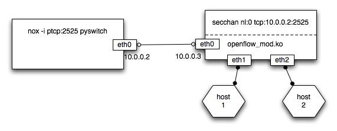

.. _sec_use:

Using NOX
===============================

Introduction
------------

NOX is intended to provide the control logic for an entire network. This
can mean many things, including: handling traffic engineering; routing;
authentication; access control; virtual network creation; monitoring;
and diagnostics.  However, NOX itself does none of these things.
Rather, it provides a programmatic interface to network components
which perform the useful functionality. 

This is a development release of NOX meaning that it is primarily
intended for component developers.  This section will provide some
background for running and testing NOX (assuming it has been successfully
installed and compiled).

Overview
--------

A NOX network consists of (predictably) NOX and one or more OpenFlow
(http://openflowswitch.org) switches.  In a standard configuration, NOX
listens on a TCP port (SSL is supported though poorly documented at the
moment) waiting for switches to connect.  Once switches connect,
NOX will dispatch network packets to the running components, and send
OpenFlow messages to the switches on behalf of the components.

NOX can be run with one or more components by specifying the components
name on the command line (NOX components are located in
*src/nox/coreapps/*, *src/nox/netapps/*, *src/nox/webapps/*). For
example::

    ./nox_core -i ptcp:2525 packetdump

This will cause NOX to listen for switches on port 2525.  The
*packetdump* component will print all received packets in ASCII to the
console.

Setting up a NOX Network
------------------------

Running NOX on real hardware
^^^^^^^^^^^^^^^^^^^^^^^^^^^^^

For NOX to be useful, you will need the following hardware:

* At least one OpenFlow-capable switch.

      Switches supporting OpenFlow are just starting to become available
      at the time of this writing.  To obtain one, contact the OpenFlow
      switch consortium (http://openflowswitch.org).  As a stand-in, you
      can easily build your own using a PC with multiple Ethernet ports.
      To do this, download a copy of the OpenFlow reference
      implementation from the OpenFlow website and refer to the README
      and INSTALLATION files in the root directory.

.. warning::

    The OpenFlow switch **must** support the same version of the
    OpenFlow protocol that NOX was built with.  To determine the version
    of OpenFlow that NOX was built again, you can use the -V command
    line option. 

*  At least one machine to use for the NOX controller.

      For testing purposes, the controller can be collocated on the
      same machine as a OpenFlow switch.  We do not encourage this
      configuration for production use.

*  You'll probably want some end hosts on the network as well. 

Running NOX
------------

To start NOX, run the NOX ``nox_core`` program in src/.  **Note** that this
must be run from the src/ directory.  Use ``nox_core --help`` for a usage
message.

Interfaces
^^^^^^^^^^^

NOX supports multiple *interfaces* for gaining access to traffic.
The standard interface is a bound TCP or SSL socket to which the
OpenFlow switches connect.  To specify the interface use, the -i argument
on the commend line.  For example, to have NOX listen on tcp port 2525
for incomding OpenFlow connections, issue the following command::

  ./nox_core -i ptcp:2525

Under this configuration, an OpenFlow switch can connect to nox on port
2525 to establish the OpenFlow communication channel.

NOX supports the following interfaces:

* *Passive TCP* (``-i ptcp:<portno>``) accepts incoming TCP connections.
* *Active TCP* (``-i tcp:ip:<portno>``) active outgoing TCP connections.
* *Passive SSL* (``-i pssl:<portno>)`` accepts incoming SSL connections.
* *Active SSL* (``-i ssl:ip:<portno>``) active outgoing SSL connections.
* *pcap* (``-i pcap:/path/to/pcapfile[:/path/to/outfile]``) reads traffic
  from a pcap file, and alternatively write all output packets to an outfile
  (used for testing).
* *Generated packets* (``-i pgen:<# to generate>``) generates a flood of
  identical packets (used for testing).
     

Running NOX with an OpenFlow reference switch 
^^^^^^^^^^^^^^^^^^^^^^^^^^^^^^^^^^^^^^^^^^^^^^

NOX is developed and tested against the OpenFlow reference
implementation.  This subsection will briefly describe how to configure
a reference switch to operate with NOX.  For more details regarding the
OpenFlow reference implementation, please refer to its documentation.

We assume the following network setup.  

Both NOX and OpenFlow are running on standard Linux PCs.  The OpenFlow
switch has two NICs which are acting as the switch ports and an
additional interface (with IP 10.0.0.3) which it uses to connect to NOX.
NOX is configured with a single NIC (with IP 10.0.0.2) which which it
connects to the OpenFlow switch.  Both NOX and the switch should be able
to ping each other. 

This setup assumes an out-of-band control network (10.0.0/24) to which
OpenFlow is not running.  However it is also possible to set up NOX and
OpenFlow to use in-band control.  The OpenFlow documentation provides
detailed instructions on how to configure in-band control. 

The switch is set up with a single datapath connected to eth1 and eth2.
Doing this from a compiled OpenFlow source tree (on the switch) should
look something like::

     > insmod datapath/linux-2.6/openflow_mod.ko
     > utilities/dpctl adddp nl:0
     > utilities/dpctl addif nl:0 eth1
     > utilities/dpctl addif nl:0 eth2

Run *nox_core* on the NOX host to listen to port 2525 and run the python
L2 switch component::

    cd src/
    ./nox_core -i ptcp:2525 pyswitch

The final step is to run the secure channel on the switch to connect the
datapath and NOX.  From the switch, this looks like::

    > secchan/secchan nl:0 tcp:10.0.0.2:2525

If everything went well, *host 1* should be able to communicate with
*host 2* through the switch software running on NOX.

Running NOX Component 
^^^^^^^^^^^^^^^^^^^^^^^^^^^^^^^^^^^^^^^^^^^^

To run a NOX component, simply specify the component name on the
command line.  Multiple components can specified as needed.  For
example, to perform network-wide Layer 2 switch in C++ and to print out
all received packets, you can run the *switch* and *packetdump*
components::

    nox_core -i ptcp:2525 switch packetdump

Most of the available components in NOX depend on other components
(these dependencies are shown in the component's meta.xml file).  NOX
will automatically load all dependencies. 

