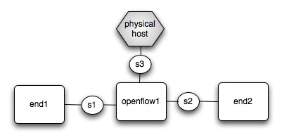

.. _vm_environment:

Setting Up a Virtual Testing Environment
========================================= 

Developing and testing NOX can be cumbersome with physical switches.  An
attractive alternative is to run NOX, OpenFlow switches and end hosts on
the same host using virtual machines.   This distribution provides some
utility scripts which help set up a topology of virtual switches using
KVM or QEMU.  These instructions assume the use of debian Lenny, ymmv
with other distributions.

Quickstart
-----------

The quickest way to get up and running is to download all the necessary
files pre-built.  More detailed instructions for building your own
environment are included below. 

* Install the following debian packages::

    apt-get install genisoimage qemu debootstrap sharutils vde2 screen
    slirp 

* Download the filesystem, linux kernel binary, and openflow binaries (including kernel module).  Be sure to use the directory structure shown below::

    mkdir vm
    cd vm
    wget http://noxrepo.org/hda.dsk.gz 
    gunzip hda.dsk.gz
    wget http://noxrepo.org/kernel.bin
    wget http://noxrepo.org/vms-1sw-2hsts.conf
    mkdir openflow1.cd
    cd openflow1.cd
    wget http://noxrepo.org/openflow_mod.ko
    wget http://noxrepo.org/dpctl
    wget http://noxrepo.org/secchan
    chmod 755 dpctl secchan 

* Add *nox/src/utilities/* to **$PATH**.  For example, if you had cloned a repository in *$HOME/src/*, you could add the following line to the bottom of your .bashrc::

    export PATH=$PATH:$HOME/nox/src/utilities/

* Pop up three new windows and run the monitor program (e.g., using xterm)::

    xterm -e monitor end1&
    xterm -e monitor end2&
    xterm -e monitor openflow1&

* cd into the *vm/* directory. It should have the following files (*kernel.bin*, *hda.dsk*, *vms-1sw-2hsts.conf*). It should also have a directory called *openflow1.cd* with the following files (*openflod_mod.ko*, *dpctl*, *secchan*). Run the following command::

    start-test-vm --vmm=qemu vms-1sw-2hsts.conf

* Each of the xterms running ``monitor`` should have sprung to life showing Linux booting. While they're booting, go ahead and start NOX (e.g., using port 2525)::

    cd path/to/nox/src
    ./nox_core -v -i ptcp:2525 monitorsui switchstatsws pyswitch pyauthenticator 

* Once you've got a boot prompt, log into the virtual machine monitoring 'openflow1' using ``root/root`` and issue the following commands (using the same port for ``secchan`` as in ``nox_core``)::

    cd /cdrom
    dhclient # remember which IP you got a dhcp reply from.  Let's assume
             # its eth2
    ping 10.0.2.2 # verify that you can ping the host OS
    insmod ./openflow_mod.ko # run the openflow datapath
    ./dpctl adddp nl:0 # create a new openflow datapath
    ./dpctl addif nl:0 eth0 # be sure this isn't the interface connected
                            # to the host
    ./dpctl addif nl:0 eth1 # ditto
    ./secchan nl:0 tcp:10.0.2.2:2525 # run secure channel and connect to
                                     # the host

* Log into the other two virtual machines (using ``root/root``) and give the interfaces different IP addresses on the same subnet::

    end1> ifconfig eth0 10.0.0.1
    # On the other VM 
    end2> ifconfig eth0 10.0.0.2
    end2> hping3 10.0.0.1

* If all went well, you should be able to ping 'end1' from 'end2' and vice versa.  Note that we use **hping3** in the example because it creates a new flow for each packet.

* From your localhost, you can verify that the switches and hosts are connected by pointing your browser to http://localhost:8888/

* **Whew!**

*  Note that **kvm** is much faster than **qemu** but can be more painful to install.  If you have KVM running locally then run  ``start-test-vm`` as follows:: 

        start-test-vm --vmm=kvm vms-1sw-2hsts.conf

Detailed Setup Instructions 
------------------------------

Building your own Linux kernel 
^^^^^^^^^^^^^^^^^^^^^^^^^^^^^^

To run a NOX network you'll first need working openflow switches.  You
can either download and install the binaries used in the quickstart
above, or you can compile your own.  To compile openflow, you'll need a
Linux source tree configured to build a kernel for QEMU.

* Get the Linux kernel source (you can ftp it from ftp.kernel.org or git-clone it)::

    git-clone git://git.kernel.org/pub/scm/linux/kernel/git/torvalds/linux-2.6.git linux-2.6

* configure the kernel.  You can use the config file at http://noxrepo.org/linux2.6.qemu.config::
    
    wget http://noxrepo.org/linux2.6.qemu.config
    cp linux2.6.qemu.config linux2.6/.config
    cd linux2.6/
    yes '' | make oldconfig
    make bzImage

* Once compiled, the following image should have been built::

    linux-2.6/arch/i386/boot/bzImage 

Building OpenFlow 
^^^^^^^^^^^^^^^^^^

* Get the latest openflow release from http://openflowswitch.org and configure against your Linux source tree::

    tar -zxvf openflow-v0.8.1.tar.gz 
    cd openflow-v0.8.1
    ./configure --with-l26=/path/to/linux-2.6/
    make

* This should create the following binaries::

    openflow-v0.8.1/datapath/linux-2.6/openflow_mod.ko
    openflow-v0.8.1/secchan/secchan
    openflow-v0.8.1/utilities/dpctl
    openflow-v0.8.1/controller/controller

Using vms.conf to specify virtual topologies
^^^^^^^^^^^^^^^^^^^^^^^^^^^^^^^^^^^^^^^^^^^^^

We have our own set of scripts that greatly simplifies creating test
environments. At its core is a config file (the default name is 'vms.conf'),
which you should create in your *vm/* directory. A vms.conf file let's you
create a collection of virtual hosts and a virtual network that connects these
virtual hosts to each and your physical machine. Here an example configuration
that you can copy and paste into vms.conf::

    SWITCHES="s1 s2 s3"
    s3_SLIRP=yes # interface that connects to host machine
    VMS="end1 end2 openflow1"
    end1_NETS=s1
    end2_NETS=s2
    openflow1_NETS="s1 s2 s3"
    FOREGROUND=openflow1 # default to openflow console  

This configuration file corresponds to the following virtual topology, with
three virtual hosts (in white) connected by dumb switches (small circles) to each
other and the physical host (in grey).

For the purposes of our setup, we will be using the virtual host 'openflow1' as
the openflow switch that connects two end-hosts 'end1' and 'end2'. We will run
the controller directly on the physical host, making it easy to recompile and
change the controller. It is important to remember that "switches" in the
parlance of vms.conf are simply dumb connectors, NOT openflow switches.

Each virtual host in the above configuration uses the default disk image
*hda.dsk* and default kernel *kernel.bin*, but for more sophisticated set-ups
you can configure each host directly as described in the *vms.conf* man page,
which is in the *openflow/src/man/man5* directory.  

You can download a working *hda.dsk* from http://noxrepo.org.::

    wget http://noxrepo.org/hda.dsk.gz

You can use a kernel binary you've compiled yourself (as described above)::

    # from your vm/ directory
    ln -s /path/to/linux-2.6/arch/i386/boot/bzImage ./kernel.bin

Or you can download a working binary from http://noxrepo.org::

    wget http://noxrepo.org/kernel.bin

.. warning::

    If you use the kernel binary from noxrepo.org you **must** also use
    the associated openflow binaries: *secchan*, *dpctl*, *openflow_mod.ko*
  
Using ``start-test-vm``, ``stop-test-vm``, and ``screen``
^^^^^^^^^^^^^^^^^^^^^^^^^^^^^^^^^^^^^^^^^^^^^^^^^^^^^^^^^^

We have handy utilities called ``start-test-vm`` and ``stop-test-vm`` to create and
destroy virtual network environments. The scripts assume that they are in the
default **$PATH**, so either change your path to include *nox/src/utilities/*
or copy/symlink the files to a location like */bin* .

When ``start-test-vm`` is run from within the *vm/* directory, it automatically
starts the VMs specific in vms.conf and builds the appropriate virtual network.
More information on ``start-test-vm`` can be found in its man page, also located
in *nox/src/man/man1*.

To start a test environment, from within the *vm/* directory run::

     start-test-vm --vmm=qemu 

To gain console access to each of the virtual hosts, the scripts use the
``screen`` utility (try ``man screen``). For example, to gain console access to one
of your virtual hosts, for example, 'end1', type::

     screen -r end1 

To exit, type 'Ctrl-o' followed by 'd', which stands for disconnect.
(The 'screen' man pages list commands as starting with Ctrl-a instead
of Ctrl-o, but ``start-test-vm`` changes ``screen``'s escape key to Ctrl-o
because QEMU also uses Ctrl-a as an escape key.)

The ``FOREGROUND=openflow1`` line in the above vms.conf file specifies that screen
should automatically bring up the openflow console in the terminal where the
user invoked ``start-test-vm``. You can use other terminals to execute ``screen -r
end1`` and ``screen -r end2``. A good trick to keep your terminals organized is to
stack them on top of each other and change the window titles to represent the
corresponding virtual host names.

In general, if you need to know what virtual hosts are available with screen,
the following command will print a list, along with each virtual host's status
(attached, detached) from screen::

     screen -ls 

When you are done using the test VMs, or need to change something in vms.conf,
run ``stop-test-vm`` which will kill all virtual hosts and disconnect the
screens.

Accessing Physical Host Files
^^^^^^^^^^^^^^^^^^^^^^^^^^^^^^^
You will want virtual hosts to be able to access files located on the
physical host.  ``start-test-vm`` supports this by creating an iso image of
a directory named after the virtual host (suffixed by *.cd*). [#]_

As an example, change to your *vm/* directory and create a new directory named
*openflow1.cd*::

     mkdir openflow1.cd

This directory will be mounted at */cdrom* for each of the virtual hosts.

Since we want the virtual host 'openflow' to act as an openflow switch,
it will need access to the openflow binaries and the openflow kernel
module. Assuming you have already built openflow, make the following
sym-links in the openflow1.cd directory. From the *openflow1.cd/*
directory::

     ln -s /path/to/openflow/utilities/dpctl 
     ln -s /path/to/openflow/secchan/secchan
     ln -s /path/to/openflow/datapath/linux-2.6/openflow_mod.ko 

Restart your virtual test environment using ``stop-test-vm`` and
``start-test-vm`` and you should be able to access these three files in the
*/cdrom* directory of each virtual host.  

Running an openflow switch and the NOX controller
^^^^^^^^^^^^^^^^^^^^^^^^^^^^^^^^^^^^^^^^^^^^^^^^^^^

We are now going to actually run the openflow switch and NOX controller to
forward packets between virtual hosts 'end1' and 'end2'.

Use screen to access host 'openflow1'. We first need openflow to get an IP
address in the QEMU virtual network so it can communicate with the physical
host. On openflow1, run::

     dhclient eth2

openflow1 should receive an internal IP (e.g., 10.0.2.15) for eth2 within a
couple seconds. You can test that you can access the physical host using::

     ssh 10.0.2.2
     # alternatively you can use your physical hosts real IP

If ssh responds, you are ready to move on to the next step (note: for
some reason the NATing performed by the SLIRP interface does not support
ping, so a simple ping check will fail).

The other two interfaces on 'openflow1' **DO NOT** need IP addresses assigned,
since they will be acting only as a L2 switch ports for your openflow
switch.

However, eth0 on 'end1' and 'end2' need IP addresses. On 'end1' type::

     ifconfig eth0 10.10.0.1 netmask 255.255.0.0

On 'end2' type::

     ifconfig eth0 10.10.0.2 netmask 255.255.0.0

This gives both hosts addresses on the local subnet 10.10.0.0/16,
connected by an openflow switch on 'openflow1'. However, because the
openflow switch is not running, these two hosts cannot talk to each
other.

Starting and configuring the openflow switch
^^^^^^^^^^^^^^^^^^^^^^^^^^^^^^^^^^^^^^^^^^^^^^^

Next, we are going to get the openflow switch on 'openflow1' up and
running. The first step is to change to the */cdrom* directory that
contains all of the openflow binaries.::

     cd /cdrom

Next, load the openflow kernel module::

     insmod openflow_mod.ko 

In order to configure the openflow kernel module, we use the user-space
utility ``dpctl`` (sometimes pronounced "D-P-kettle"). The acronym "DP"
used in this section refers to "data-path", another name for an
openflow switch.

First, we use the ``dpctl`` command ``adddp`` to create ('add') a new
openflow switch with id = "0"::

     ./dpctl adddp nl:0

Next, we use the ``addif`` command to add 'openflow1's two interfaces (to the
switch with id = "0").::

     ./dpctl addif nl:0 eth0
     ./dpctl addif nl:0 eth1
     ./dpctl show nl:0 

The last command simply prints the current state of the switch with id =
"0". It should show both interfaces.

Even though the openflow switch is running, we will not be able to
forward traffic between virtual hosts 'end1' and 'end2'. This is because the
openflow switch has no flow entries, and thus will try to forward each
incoming packet to a NOX controller, which is not yet running. 

Connecting the switch and the controller
^^^^^^^^^^^^^^^^^^^^^^^^^^^^^^^^^^^^^^^^^^

Now we need to create a communication channel between the openflow
switch running on openflow and NOX controller software running on the
physical host.

First, start the controller (e.g.: using port 2525, run)::

     ./nox_core -v -i ptcp:2525 pyswitch 

This will start an unencrypted controller listening on the specified port
of your physical machine. This simple controller just receives packets
from a switch and installs the corresponding flow entry in the switch to
forward that packet and subsequent packets from the same stream. The
"-v" flag is optional, providing more verbose debugging output.

Now, switch to 'openflow1' and run the ``secchan`` binary that sets up a
"secure channel" between the openflow switch and the controller.
Remember to use the IP address associated with your own physical host.
On 'openflow1' run::

     ./secchan nl:0 tcp:10.0.2.2:2525

``secchan`` should indicate that it has successfully connected to the
controller running on the physical host.

You should now be able to send packets between virtual hosts 'end1' and
'end2'. For example, from 'end1'::

    ping 10.10.0.2

Exploring NOX and openflow
-----------------------------

This section suggests a few things you can mess around with to get more
familiar with how openflow and NOX is operating within your simple
set-up.

Viewing Openflow Switch State
^^^^^^^^^^^^^^^^^^^^^^^^^^^^^^^^^

``dpctl`` also provides utilities to look at current switch state. To do
so, we want to run ``secchan`` in the background so we can use our
openflow screen to run ``dpctl``. Kill ``secchan`` and invoke it again in the
background using "&". Whenever you need to kill ``secchan``, just type
``killall secchan`` or use ``ps`` to find the PID and kill it directly.

First, let's view the different tables used by the openflow switch::

     ./dpctl dump-tables nl:0

Because flow entries time-out fairly quickly (i.e.: after a couple seconds),
"n_flows" for each of these tables is likely to be zero. Run ``ping``
between 'end1' and 'end2' and notice that this changes.

Next, let's look at the flow entries created for the ping traffic.
Assuming table "1" is the one with the flows, use::

     ./dpctl dump-flows nl:0 1  

You can send traffic other than ICMP pings to see how the flow entries
differ. For example, to create a tcp connection with ``netcat``, do the
following on 'end2'::

     netcat -l -p123

This creates a server listening on port 123 and echoing all received
data to the console. To connect to this server from 'end1', type::

     netcat 10.10.0.2 123

Now, anything you type on 'end1' will be printed on 'end2', creating a
long-standing tcp flow between the two hosts. Remember the flow entries
time-out quickly though, so you may need to send additional data to
re-create a flow entry.

.. rubric:: Footnotes

.. [#]  Another approach is to mount the physical host's file-system on
   each virtual host using NFS.
